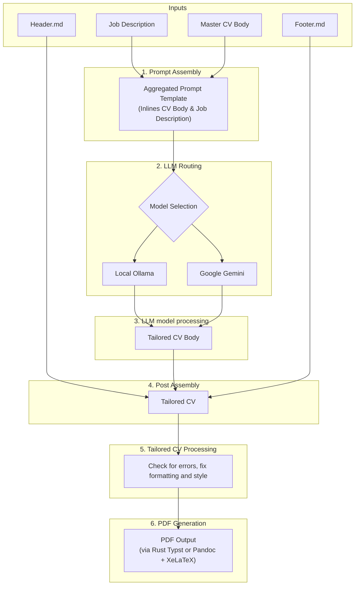

# Job Hunt & CV Tailoring Workspace

Welcome to the **Job Hunt & CV Tailoring Workspace**, a comprehensive, multi-stack ecosystem designed to automate, optimize, and benchmark your job application lifecycle.

This repository contains independent tools built in **Python**, **TypeScript**, and **Rust** to scrape job listings, evaluate role compatibility with local LLMs, parse/validate Markdown CV schemas, tailor resumes for ATS platforms, and benchmark LLM outputs.

---

## Workspace Directory Overview

The project is organized into independent, modular tools residing in the `tools/` directory. There is no shared code between them, allowing you to run whichever stack fits your preference.

| Module                                                                               | Stack                | Primary Interfaces  | Description                                                                                                              |
| :----------------------------------------------------------------------------------- | :------------------- | :------------------ | :----------------------------------------------------------------------------------------------------------------------- |
| **[`prep_for_cv_tail`](file:///home/kirill/prj/gh/job-hunt/tools/prep_for_cv_tail)** | Rust + Tauri         | Desktop GUI & CLI   | Desktop editor and prompt compiler using pure-Rust Typst PDF generation (no external LaTeX/pandoc requirements).         |
| **[`tailor_cv_py`](file:///home/kirill/prj/gh/job-hunt/tools/tailor_cv_py)**         | Python + Streamlit   | CLI & Web UI        | Streamlit dashboard and lightweight CLI leveraging Ollama/Gemini for tailoring. Renders PDF via Pandoc.                  |
| **[`tailor_cv_ts`](file:///home/kirill/prj/gh/job-hunt/tools/tailor_cv_ts)**         | TypeScript + Next.js | CLI & Next.js UI    | Single-page web app and Node.js CLI supporting Ollama, Gemini, and Claude (with prompt caching). Renders PDF via Pandoc. |
| **[`py`](file:///home/kirill/prj/gh/job-hunt/tools/py)**                             | Python (Advanced)    | CLI, Web UI & Evals | A comprehensive suite for scraping listings, validating CV schemas via Pydantic, and executing benchmark evaluations.    |

---

## Shared Data Flow & Architecture

All tailoring tools in this workspace implement a unified approach to ATS resume optimization:



1. **Prompt Assembly**: Combines the Master CV Body and Job Description into the LLM prompt template.
2. **LLM Routing**: Routes the prompt depending on the model name prefix to either local Ollama or Google Gemini.
3. **Conversion**: Feeds the prompt into the chosen LLM, converting the Master CV Body into an ATS-optimized Tailored CV Body (enforcing exactly 4 sections: Summary, Technical Skills, Work Experience, and Previous Experience).
4. **Post Assembly**: Combines `header.md`, the Tailored CV Body, and `footer.md` together to produce the complete Tailored CV document.
5. **Tailored CV Processing**: Validates formatting schemas, checks for syntax and rendering errors, and automatically cleans up style layouts.
6. **PDF Generation**: Compiles the final document into a high-fidelity PDF utilizing pure-Rust Typst, or `pandoc` + `XeLaTeX`/`pdflatex` (with embedded LaTeX `\hfill` layout alignments).

---

## Getting Started & Prerequisites

### System Prerequisites

To run the tools in this workspace, you will need the following dependencies installed on your system:

#### 1. PDF Compilation Engine (Required for PDF outputs)

- **Linux (Debian/Ubuntu)**:
  ```bash
  sudo apt-get install pandoc texlive-latex-extra texlive-xetex
  ```
- **macOS**:
  ```bash
  brew install pandoc BasicTeX
  ```

#### 2. Local LLM Runner (Required for local offline tailoring/matching)

Install [Ollama](https://ollama.com) and pull the recommended models:

```bash
ollama pull gemma4:e2b
ollama pull llama3.1:8b
```

#### 3. Tauri Compilation Deps (Required only for building the Rust Tauri app on Linux)

```bash
sudo apt-get install -y libwebkit2gtk-4.1-dev libwayland-dev libssl-dev libgtk-3-dev libayatana-appindicator3-dev librsvg2-dev
```

### Environment Configuration

Many tools expect a global `.env` file at the root. Copy the template or create it manually:

```bash
# In repository root
cp .env.example .env # If available, otherwise create .env
```

Ensure your `.env` contains the required keys:

```bash
# Global variables example
MASTERCV_PATH="/absolute/path/to/mastercv.md"
GOOGLE_API_KEY="your-gemini-api-key"

# job_finder crawler credentials (optional)
EMAIL="your-email"
LINKEDIN_PASSWORD="your-password"
STEPSTONE_PASSWORD="your-password"
```

---

## Component Quick Commands

### Rust Desktop Editor (`tools/prep_for_cv_tail`)

A desktop-first Tauri utility that uses a pure-Rust PDF layout engine (Typst). No external pandoc/LaTeX toolchain is needed.

```bash
cd tools/prep_for_cv_tail

# Compile and run unit tests
cargo test --lib

# Launch the Tauri desktop GUI app
cargo run --bin prep_for_tail_ui

# Or use the CLI version to output Markdown prompts
cargo run --bin prep_for_tail -- --cv master_cv.md --prompt prompt.txt --jd jd.txt -o output.md
```

### Python Streamlit & CLI (`tools/tailor_cv_py`)

A fast Python script powered by `uv` and Streamlit.

```bash
cd tools/tailor_cv_py

# Sync virtualenv and dependencies
uv sync

# Tailor a CV via CLI (outputting a PDF)
uv run tailor_cv -i master_cv.txt -j job_description.txt -o tailored_cv.pdf

# Run the Streamlit web app
just ui # or: uv run streamlit run ui/app.py
```

### TypeScript Next.js & CLI (`tools/tailor_cv_ts`)

A Node.js/Next.js single-page application with split preview screens and custom prompts editing.

```bash
cd tools/tailor_cv_ts

# Install packages
npm install

# Start Next.js development server (localhost:3000)
just dev # or: npm run dev

# Run TypeScript typechecks
npx tsc --noEmit

# Run the CLI version
npm run cli -- -i cv.txt -j jd.txt -o out.pdf
```

### Advanced Python Workspace (`tools/py`)

Houses advanced features like automated web scraping for job listing portals, syntax validation parsing, and LLM benchmarking.

```bash
cd tools/py

# Sync virtualenv and dependencies
uv sync

# Start the interactive Streamlit tailoring board
uv run streamlit run tailor_ui/app.py

# Scrape job boards (Indeed, LinkedIn, Stepstone) and filter with LLM matching
uv run python job_finder/cli/fetch_and_match.py

# Check a markdown CV for syntax & ATS parsing alignment using Pydantic parser
uv run python md_parser/cli.py cv/example/body.md

# Run test suites and format validation
uv run pytest md_parser/models_test.py
uv run ruff check .
```

---

## Contributing & Guidelines

When working inside this repository, please check the local `CLAUDE.md` present inside the root directory as well as each tool subfolder for specific coding guidelines, runtime limitations, and quick commands.
